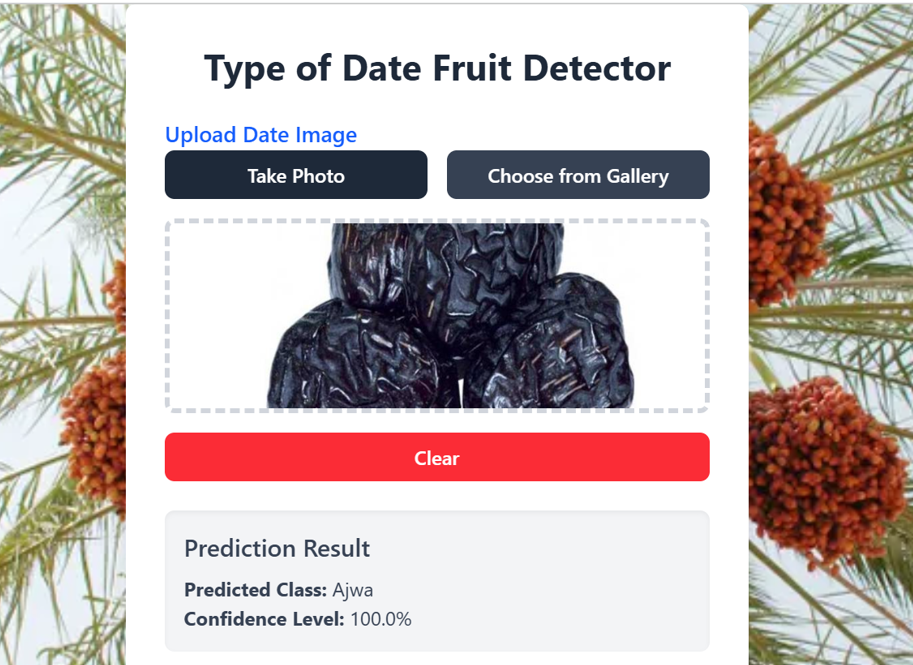

# Saudi Date Fruits Vision

A TensorFlow-based web application for classifying different types of Saudi dates fruits, along with a training pipeline for building the model.

---

## Problem Statement

Saudi dates are an important part of the cultural and economic heritage of the region. Accurate classification of different types of dates is useful for quality control, sorting, and consumer information. Manual identification is time-consuming, prone to errors, and requires expert knowledge of the various types of dates.  

There is a need for an intelligent, automated system that can classify Saudi dates efficiently. Our proposed **Saudi Date Fruits Vision** leverages machine learning and image processing to classify nine different types of Saudi dates fruits, providing a reliable tool for farmers, distributors, and retailers.

---

## Demo

Here is an example output of the system:

 


## Web Application

The web application allows users to upload images of Saudi dates fruits, and it predicts the type of fruit.

### Features

- Upload or take an image of Saudi-dates fruits.  
- Click on submit after the image has been uploaded.  
- The prediction results will display on the interface.  

---
 

**Live Demo:** [https://typeofdatedetector.vercel.app/](https://typeofdatedetector.vercel.app/)


## Classes

The model can detect **9 classes** of Saudi dates fruits:
```
CLASS_NAMES = ["Ajwa", "Galaxy", "Mejdool", "Meneifi", "NabtatAli", "Rutab", "Shaishe", "Sokari", "Sugaey"]
```


## Installation

Follow the steps below to set up the project locally:

1. **Clone repository**
   ```bash
   git clone https://github.com/riyeba/Saudi-Dates-Fruit-Vision.git
  

2. **Install the requirements**

   ```bash
   pip install -r requirements.txt
  


## Model and Training Pipeline

The classification system is built using **TensorFlow/Keras** with a **Convolutional Neural Network (CNN)** architecture. The model is trained to classify images of Saudi date varieties into **9 distinct classes**.

### Model Highlights
- Input images are resized and normalized before feeding into the model  
- Convolutional layers extract spatial features  
- Pooling layers reduce dimensionality while retaining key information  
- Fully connected layers map extracted features to output classes  
- Softmax activation is used for final classification across the 9 classes  

### Training Pipeline
1. **Data Preparation**
   - Collect and organize images of Saudi dates by class  
   - Split dataset into training, validation, and test sets  
   - Apply preprocessing: resizing, normalization, and data augmentation (rotation, flipping, brightness adjustments)  

2. **Model Training**
   - Train the CNN using TensorFlow/Keras  
   - Loss function: `categorical_crossentropy`  
   - Optimizer: `Adam`  
   - Metrics: accuracy, validation accuracy, and loss  

3. **Evaluation**
   - Evaluate the trained model on the test dataset  
   - Generate metrics such as confusion matrix and classification report  
   - Visualize training history (accuracy/loss curves)  

4. **Deployment**
   - Save the trained model (`.h5` or `.pb` format)  
   - Integrate with the web application for real-time classification
   - 

### Fast Api Codes
```bash


## FastAPI Backend for Saudi Date Classification

```python
from fastapi import FastAPI, File, UploadFile
import numpy as np
from io import BytesIO
from PIL import Image
import tensorflow as tf

app = FastAPI()

# Load the trained model
MODEL = tf.keras.models.load_model("saudidattt.h5")
CLASS_NAMES = ["Ajwa", "Galaxy", "Mejdool", "Meneifi", "NabtatAli", "Rutab", "Shaishe","Sokari","Sugaey"]

-- remaining code here
```

## Credit

This project was built using:

- **TensorFlow** – for building, training, and saving the Saudi date classification model.  
- **FastAPI** – for creating the backend API to serve predictions from the trained model.  


