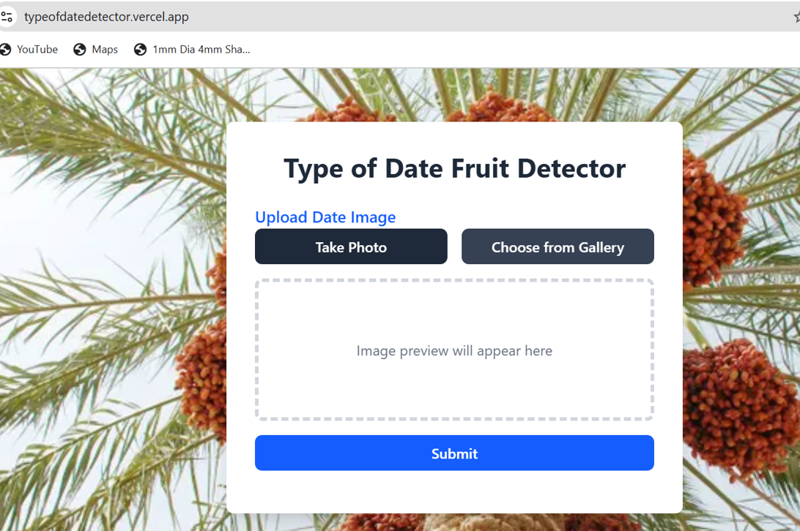

# Saudi Date Fruits Vision

A TensorFlow-based web application for classifying different types of Saudi dates fruits, along with a training pipeline for building the model.

---

## Problem Statement

Saudi dates are an important part of the cultural and economic heritage of the region. Accurate classification of different types of dates is useful for quality control, sorting, and consumer information. Manual identification is time-consuming, prone to errors, and requires expert knowledge of the various types of dates.  

There is a need for an intelligent, automated system that can classify Saudi dates efficiently. Our proposed **Saudi Date Fruits Vision** leverages machine learning and image processing to classify nine different types of Saudi dates fruits, providing a reliable tool for farmers, distributors, and retailers.

---

## Demo

Here is an example output of the system:

 


## Web Application

The web application allows users to upload images of Saudi dates fruits, and it predicts the type of fruit.

### Features

- Upload images of Saudi dates fruits.  
- Predict the class of the uploaded fruit.  
- Display prediction results on the web interface.  

---
 


## Classes

The model can detect **9 classes** of Saudi dates fruits:
```
CLASS_NAMES = ["Ajwa", "Galaxy", "Mejdool", "Meneifi", "NabtatAli", "Rutab", "Shaishe", "Sokari", "Sugaey"]
```


